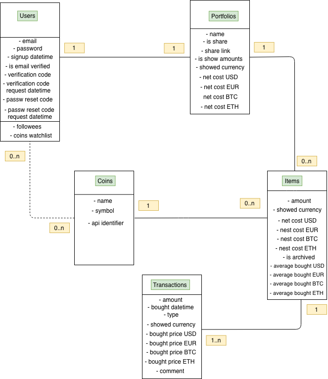
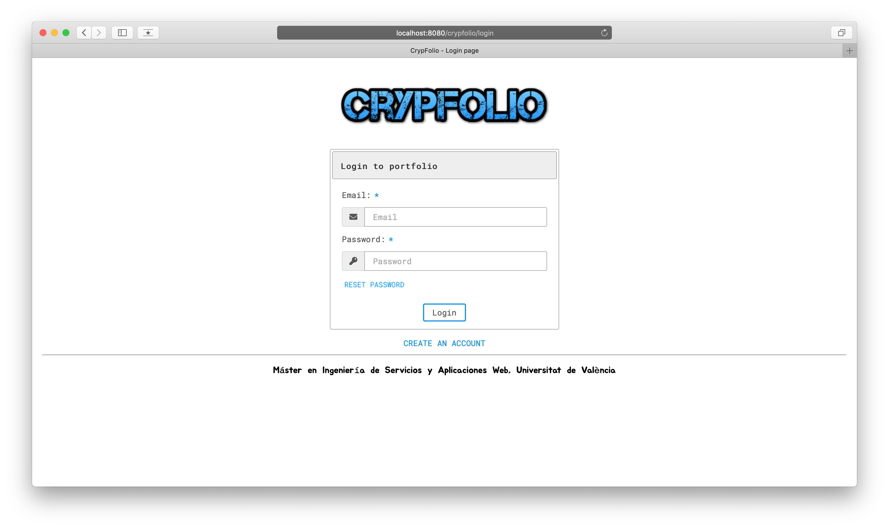
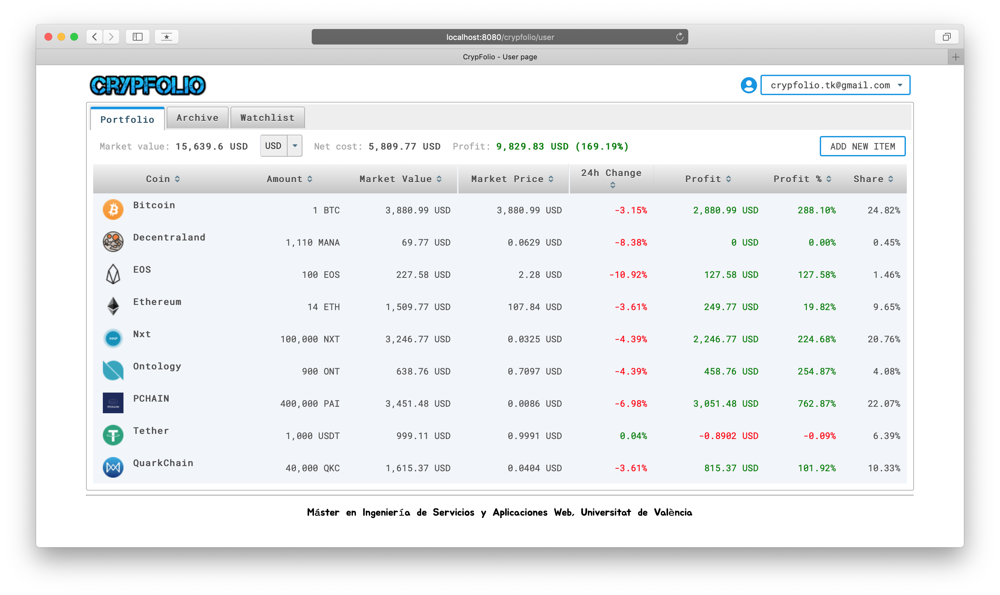
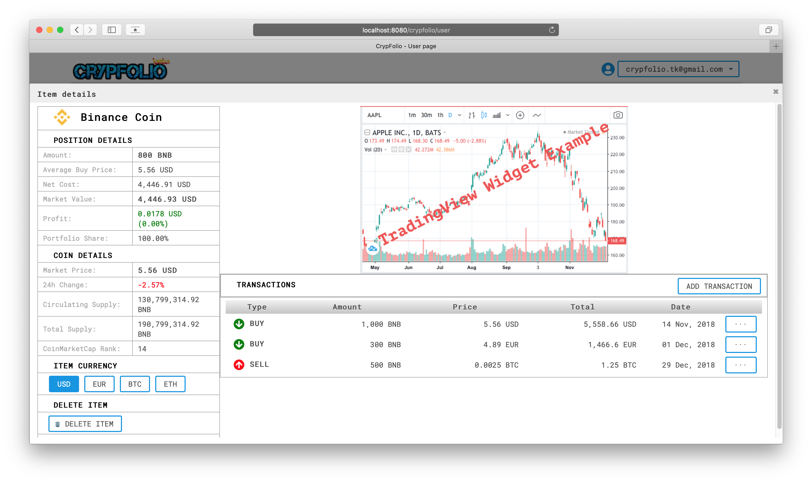
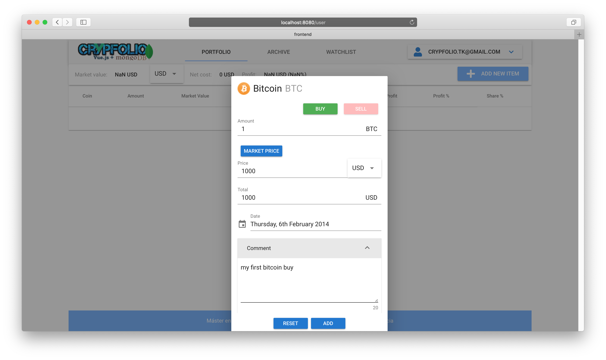
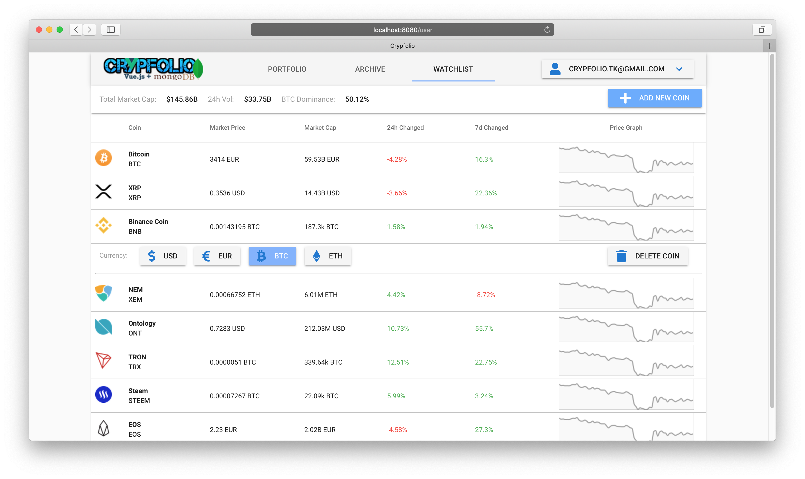

# Crypfolio

**Is under development...**

*Trabajo Fin de Máster, Universidad de Valencia, 
Ingeniería de Servicios y Aplicaciones Web (ISAW) 2018-19*

### Project goal:
to compare project performance using two different mechanisms
of storage and retrieval of data like Relational database
(**MySQL/MariaDB**) and Non Relational Database (**MongoDB**)
and two different realizations of the frontend 
frameworks of the application, like **Primefaces** and **Vue.js**

-----

This is a simple portfolio of digital cryptocoins and tokens. You can open positions 
(even add your previously made transactions) to control your investments and observe 
profit of the each coin  separately and even total market value and profit of your 
portfolio as a whole.

You can choice (USD, EUR, BTC, ETH) to create and observe 
positions. All transactions are stored in the database and  you can at any time get 
informed about them, edit or delete any.
 
You can also stay informed about your favorite crypto coins by add them into 
your separate watchlist.

Is used data from officials APIs of the 
[CoinMarketCap](https://coinmarketcap.com/api/) and 
historical prices of crypto coins from 
[CryptoCompare.com](https://min-api.cryptocompare.com/)

-----

### Versions:
* [Primefaces + MariaDB version](crypfolio-jsf-mariadb)
* [Primefaces + MongoDB version](crypfolio-jsf-mongodb)
* [Vue.js + MariaDB version](crypfolio-vuejs-mariadb)
* [Vue.js + MongoDB version](crypfolio-vuejs-mongodb)

### Conceptual Data Model:

### Some Working Screenshots:

* more screenshots are here: [Primefaces frontend](/crypfolio-jsf-mariadb/README.md#some-working-screenshots)
 and [Vue.js frontend](/crypfolio-vuejs-mongodb/README.md#some-working-screenshots)

