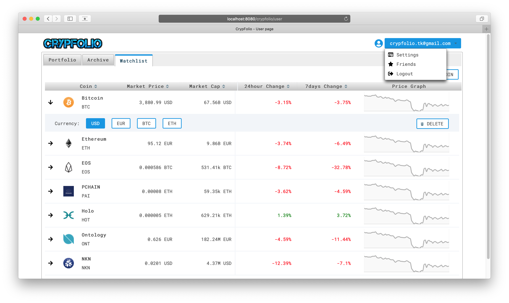
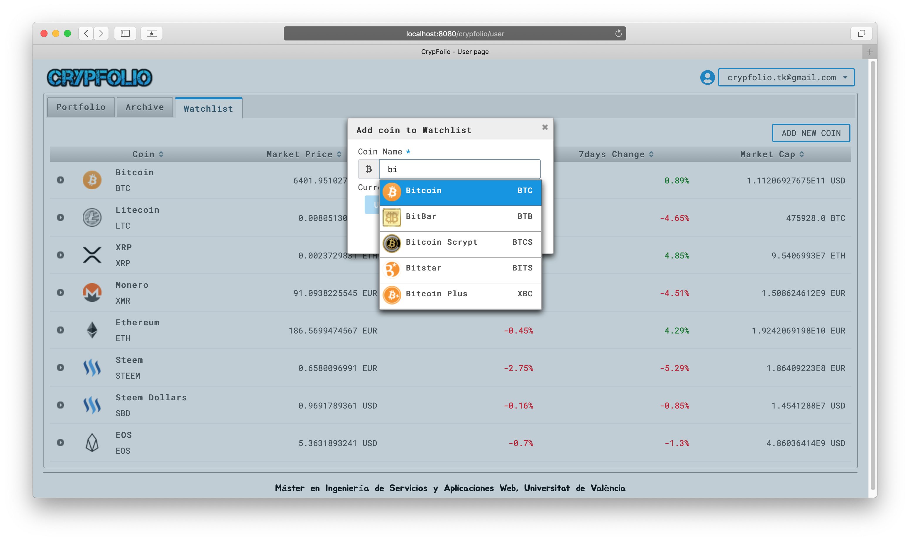

# Crypfolio

*Trabajo Fin de Máster
Universidad de Valencia, Ingeniería de Servicios y Aplicaciones Web 2017-18*

**Is under development...**

 This is a simple portfolio of the crypto coins and tokens. You can open 
 positions in your own portfolio to control your investments and see profit of the each positon
 in different currencies (USD, EUR, BTC, ETH) and your portfolio total market value.
 
 You can stay informed of your favorites coins cost by add them in your watchlist.

-----

**Conceptual Data Model:**

**Logical Data Model:**

**Some Working Screenshorts:**

