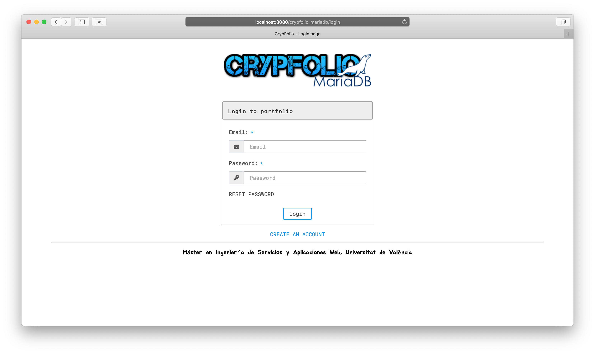
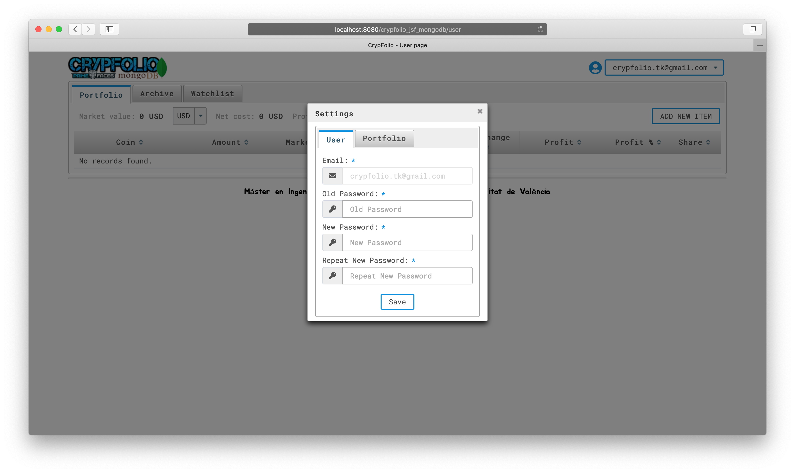
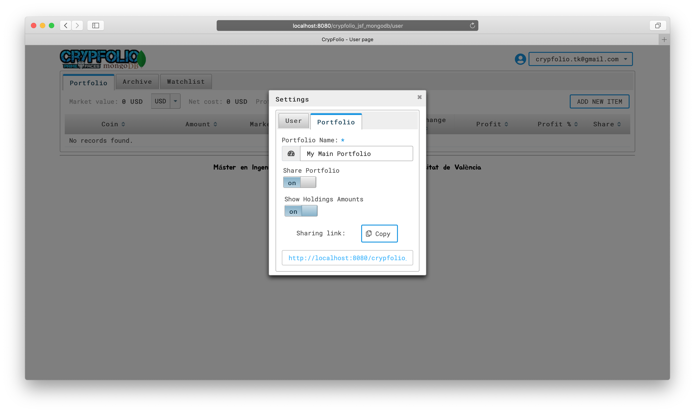

### Application Version: Java EE + Primefaces + MariaDB 
In this application version is used Relational database [MariaDB](https://github.com/MariaDB) and [Primefaces](https://github.com/primefaces) - is an open source
 UI framework for JSF

### MySQL Logical Data Model:

### <a name="primefaces-screenshots">Some Working Screenshots:</a>

