### Application Version: Java EE + Primefaces + MariaDB 
In this application version is used Relational database [MariaDB](https://github.com/MariaDB) and 
[Primefaces](https://github.com/primefaces) - is an open source UI framework for JSF

### MySQL Fisical Data Model:

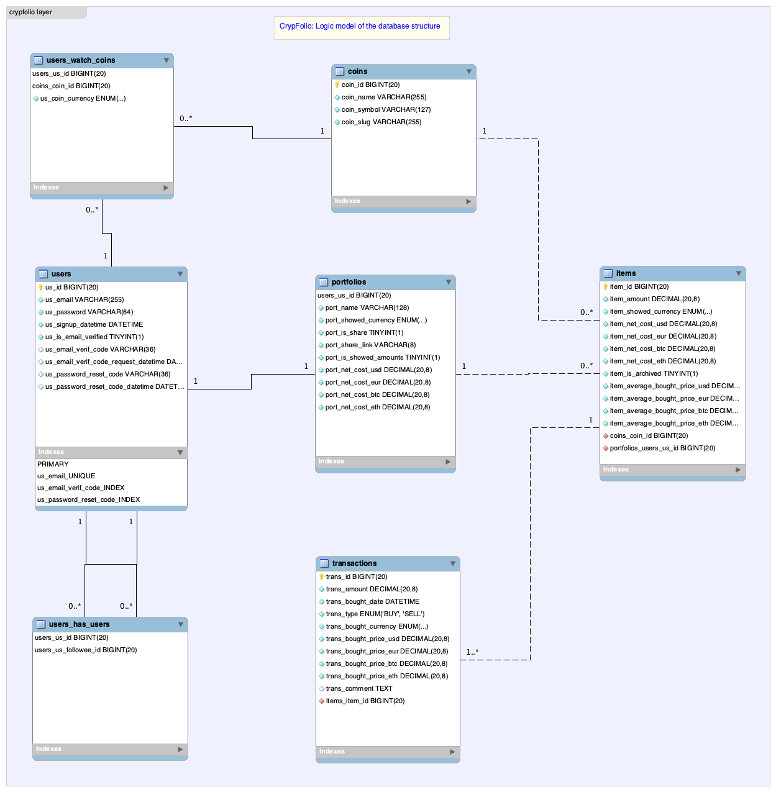

### Some Working Screenshots:

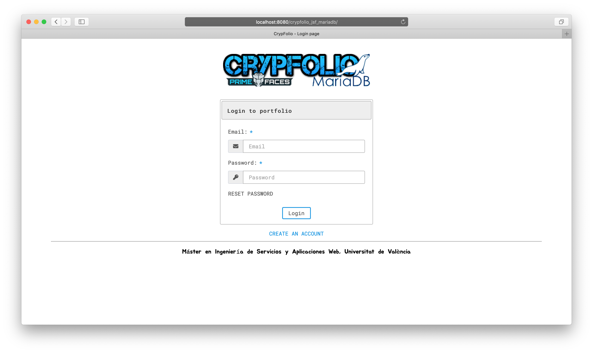

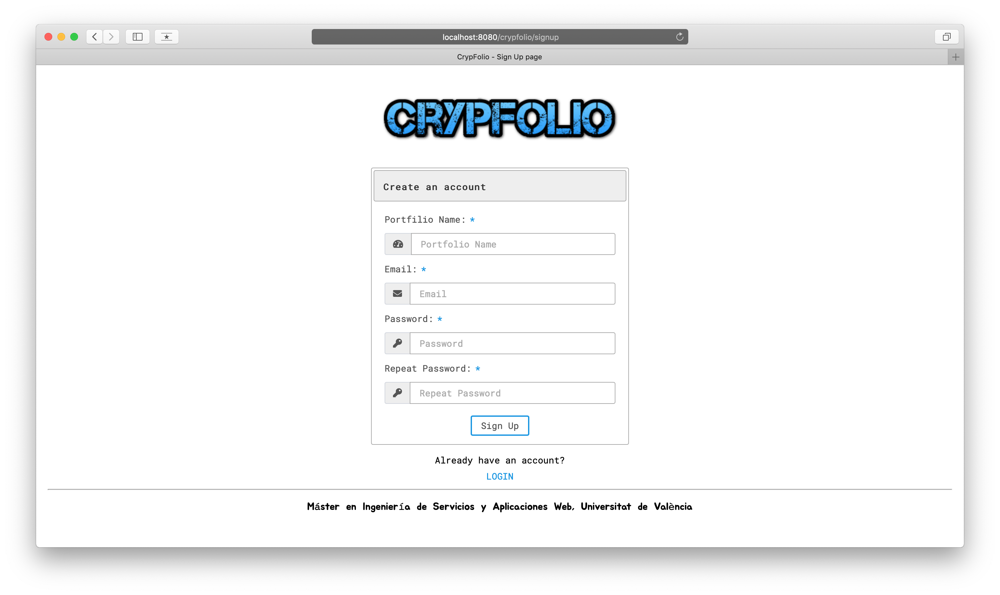

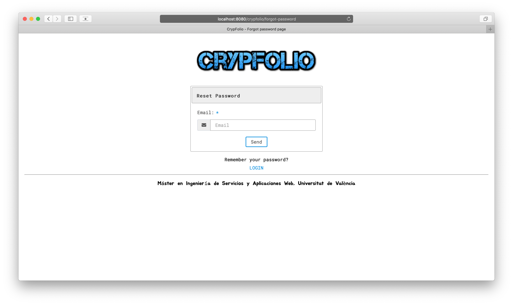

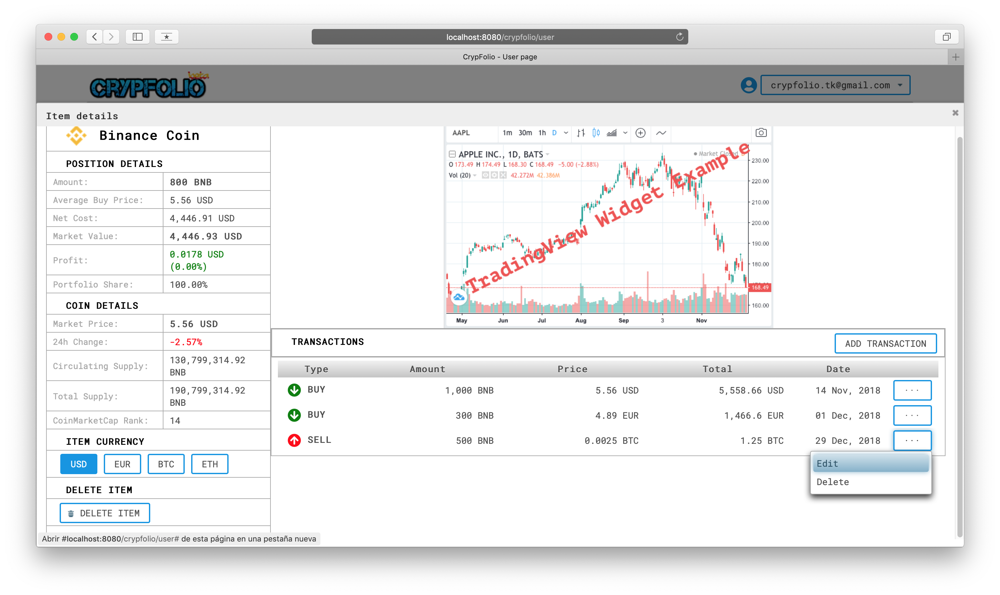

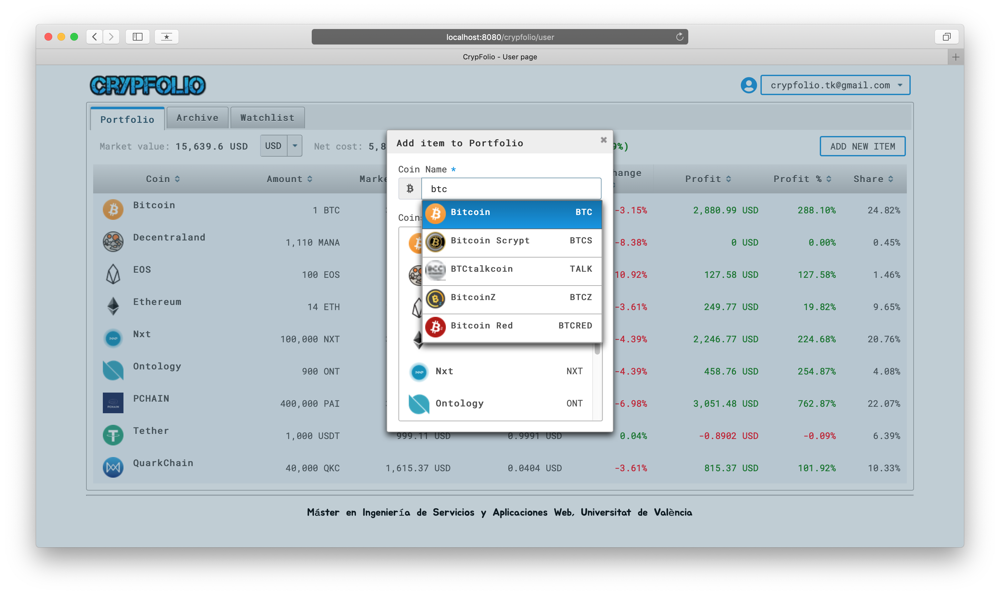

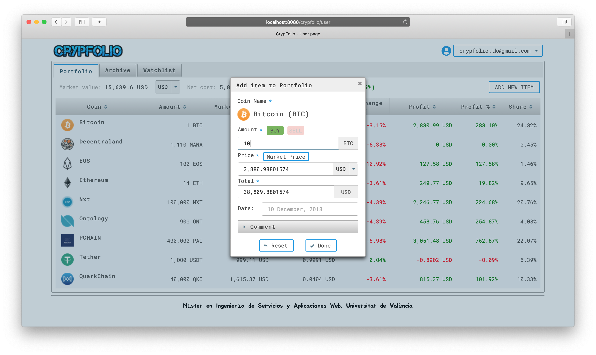

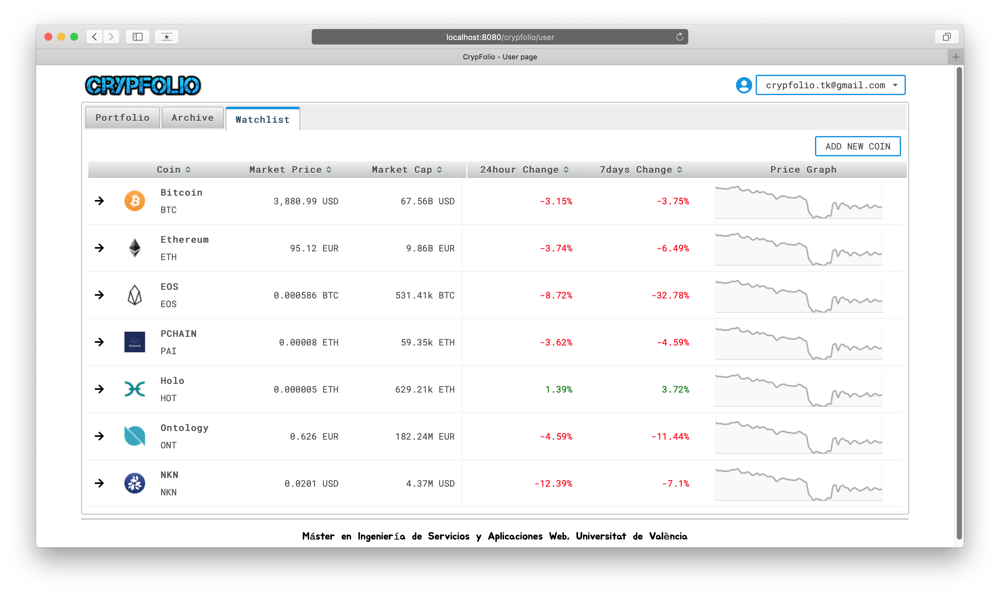

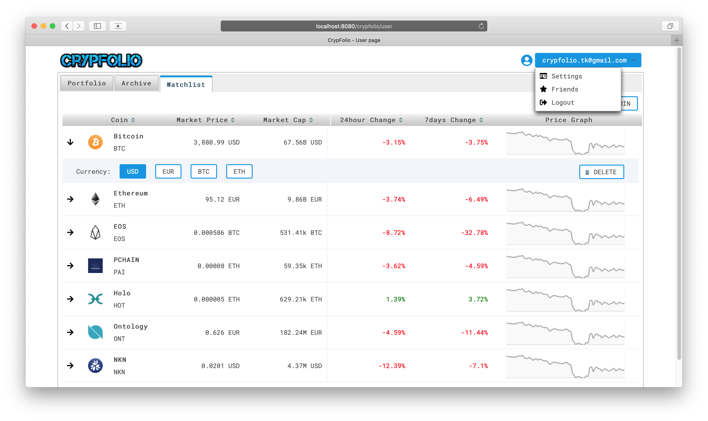

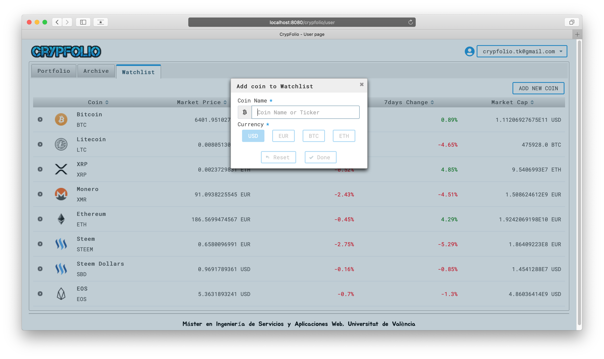

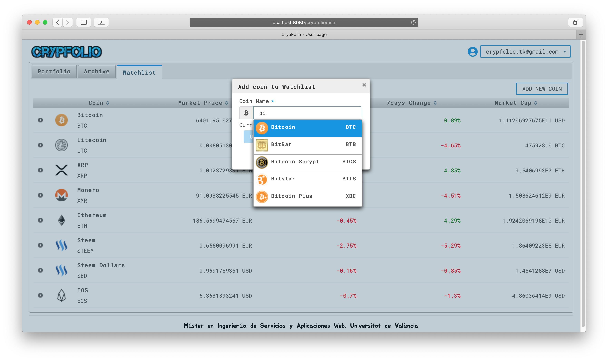

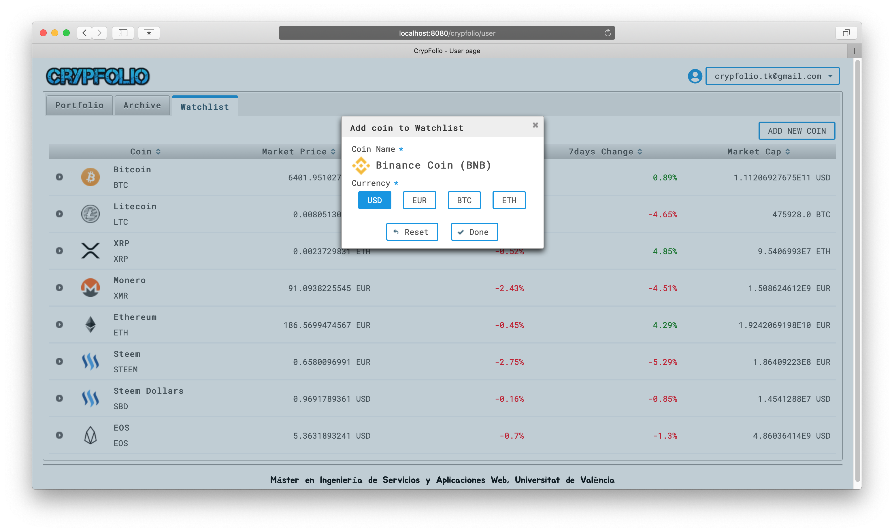

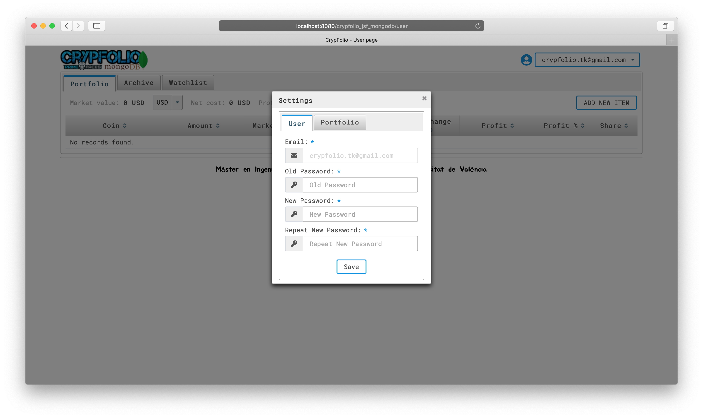

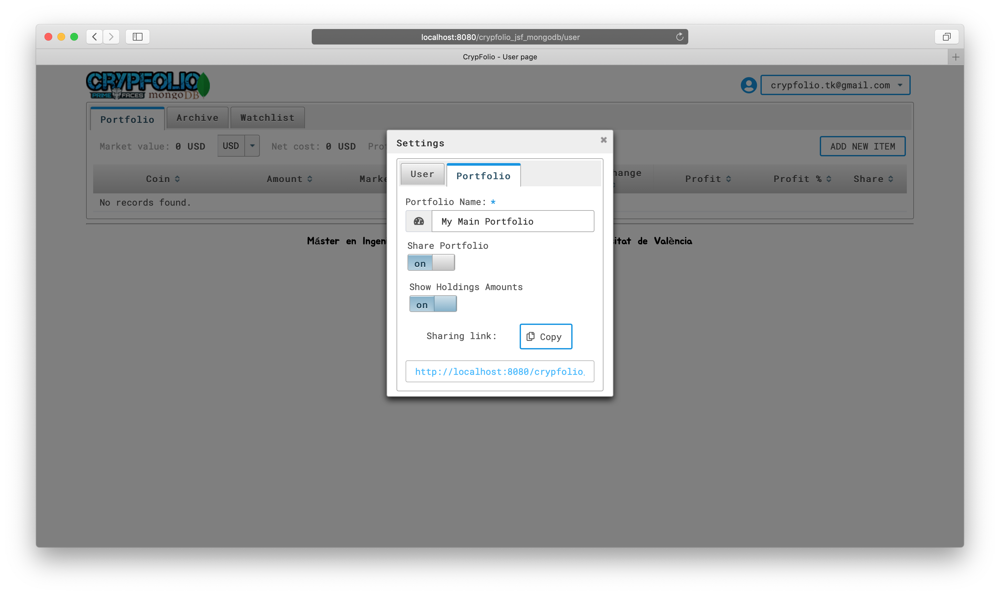