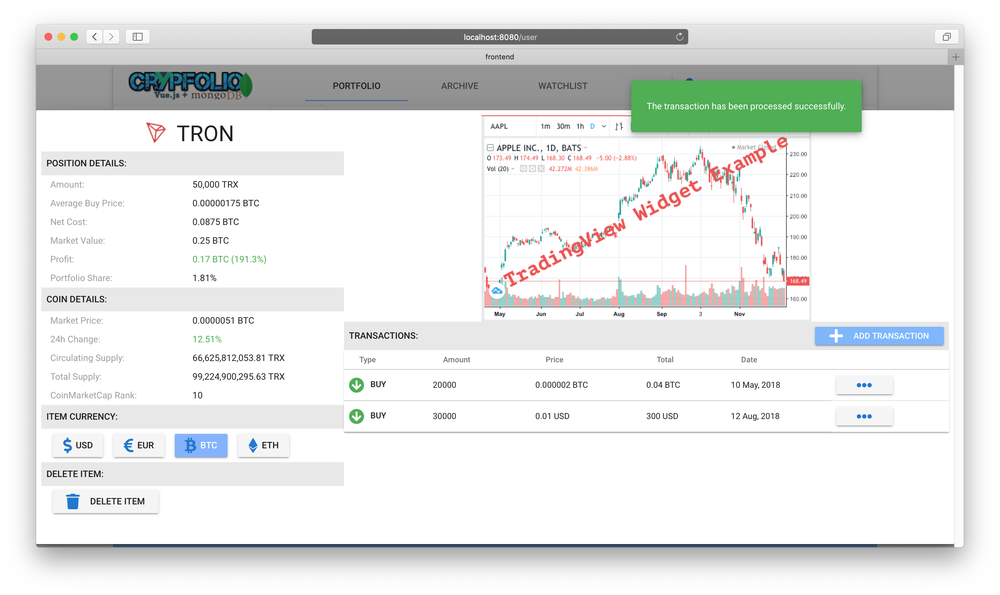
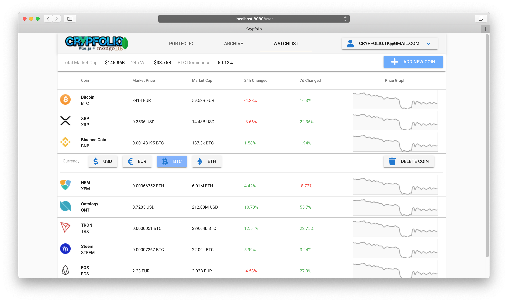

### Application Version: Java EE + Vue.js + MongoDB
In this version of the application was used Non Relational Database [MongoDB](https://github.com/mongodb) and [Vue.js](https://github.com/vuejs) - is the Progressive JavaScript Framework
 
As it is a Maven Project,  it was decided to separate the architecture for two separate parts (Maven modules) with 
main pom.xml in the project root:
+ frontend part with it's own pom.xml to build the frontend module via nodejs
+ backend part witch compiles java classes, copies frontend built sources to web directory of the backend project
 for then to package all that to the only WAR archive file to deploy on the WildFly (or other java application server)

**Project structure:**
```
crypfolio-vuejs-mongodb
├─┬ backend     → backend module all Java code
│ ├── src
│ ├── web
│ └── pom.xml
│ 
├─┬ frontend    → frontend module with Vue.js code
│ ├── src
│ └── pom.xml
│ 
└── pom.xml     → Maven parent pom managing both modules
```    

So we should build now the application with run under the root project directory **crypfolio-vuejs-mongodb**:
```
mvn clean install 
```
and then deploy the web application artifact (WAR file or exploded directory)
to the java application server

### MongoDB Document Structure:


### Vue.js used Libraries:
* Vue-router the official router for Vue.js
* Vuex state management library
* Vuetify UI framework for Vue

### Some Working Screenshots:








